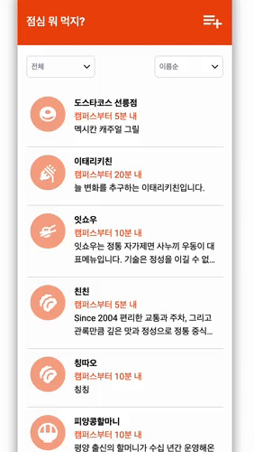
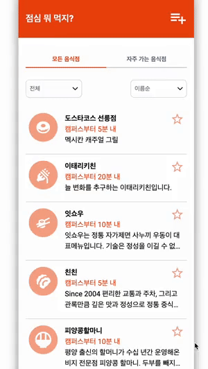
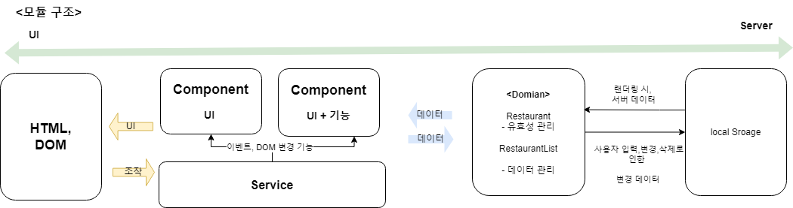

# javascript-lunch

우아한테크코스 레벨1 점심 뭐 먹지 미션

## 배포 페이지

[🖥️ 깃허브 페이지 바로가기](https://badahertz52.github.io/javascript-lunch/dist/)

## 설치

```dash
npm i
```

## 빌드

```dash
npm run build
```

## 테스트

```dash
//jest 테스트

npm run jest-test

//cypress 테스트
npm run test
```

## 구현

### step1



### step2



## 구조



### 폴더 구조

| 폴더       | 설명                                                    |
| ---------- | ------------------------------------------------------- |
| assets     | css(css 상수, 공통적으로 들어가는 스타일 관리),svg 관리 |
| components | 커스텀 웹 컴포넌트를 폴더별로 ts,css 관리               |
| constants  | 상수, enum 관리                                         |
| data       | 기본 음식적 목록 데이터 관리                            |
| domains    | 도메인 모듈 관리                                        |
| services   | 도메인과 뷰를 연결하는 컨트롤러 관리                    |
| types      | 타입 관리                                               |
| utils      | 유틸 함수 관리                                          |

### 파일 구조

<details>
<summary>🗂️ 파일 구조 보기</summary>
<div markdown="1">

```
src
 ┣ assets
 ┃ ┣ css
 ┃ ┃ ┣ main.css
 ┃ ┃ ┣ scrollbar.css
 ┃ ┃ ┣ style-constants.css
 ┃ ┃ ┗ topbar.css
 ┃ ┗ svg
 ┃ ┃ ┣ add-button.svg
 ┃ ┃ ┣ category-asian.svg
 ┃ ┃ ┣ category-chinese.svg
 ┃ ┃ ┣ category-etc.svg
 ┃ ┃ ┣ category-japanese.svg
 ┃ ┃ ┣ category-korean.svg
 ┃ ┃ ┣ category-western.svg
 ┃ ┃ ┣ favorite-icon-filled.svg
 ┃ ┃ ┗ favorite-icon-lined.svg
 ┣ components
 ┃ ┣ AddStoreBtn
 ┃ ┃ ┣ index.ts
 ┃ ┃ ┗ style.css
 ┃ ┣ AllRestaurantList
 ┃ ┃ ┣ index.ts
 ┃ ┃ ┗ style.css
 ┃ ┣ CategoryIcon
 ┃ ┃ ┣ index.ts
 ┃ ┃ ┗ style.css
 ┃ ┣ CustomInput
 ┃ ┃ ┣ index.ts
 ┃ ┃ ┗ style.css
 ┃ ┣ CustomModal
 ┃ ┃ ┣ index.ts
 ┃ ┃ ┗ style.css
 ┃ ┣ CustomTextarea
 ┃ ┃ ┣ index.ts
 ┃ ┃ ┗ style.css
 ┃ ┣ DefaultBtn
 ┃ ┃ ┣ index.ts
 ┃ ┃ ┗ style.css
 ┃ ┣ DropBox
 ┃ ┃ ┣ index.ts
 ┃ ┃ ┗ style.css
 ┃ ┣ ErrorMessageBox
 ┃ ┃ ┣ index.ts
 ┃ ┃ ┗ style.css
 ┃ ┣ FavoriteIcon
 ┃ ┃ ┣ index.ts
 ┃ ┃ ┗ style.css
 ┃ ┣ FavoriteRestaurantList
 ┃ ┃ ┣ index.ts
 ┃ ┃ ┗ style.css
 ┃ ┣ FormInput
 ┃ ┃ ┗ index.ts
 ┃ ┣ FormTextField
 ┃ ┃ ┗ index.ts
 ┃ ┣ NavigationBar
 ┃ ┃ ┣ index.ts
 ┃ ┃ ┗ style.css
 ┃ ┣ NoneRestaurant
 ┃ ┃ ┣ index.ts
 ┃ ┃ ┗ style.css
 ┃ ┣ RestaurantDescription
 ┃ ┃ ┣ index.ts
 ┃ ┃ ┗ style.css
 ┃ ┣ RestaurantDistance
 ┃ ┃ ┣ index.ts
 ┃ ┃ ┗ style.css
 ┃ ┣ RestaurantFormModalInner
 ┃ ┃ ┣ index.ts
 ┃ ┃ ┗ style.css
 ┃ ┣ RestaurantInfoModalInner
 ┃ ┃ ┣ index.ts
 ┃ ┃ ┗ style.css
 ┃ ┣ RestaurantItem
 ┃ ┃ ┣ index.ts
 ┃ ┃ ┗ style.css
 ┃ ┗ RestaurantName
 ┃ ┃ ┣ index.ts
 ┃ ┃ ┗ style.css
 ┣ constants
 ┃ ┣ dropBox.ts
 ┃ ┣ index.ts
 ┃ ┣ message.ts
 ┃ ┣ rule.ts
 ┃ ┗ storageKey.ts
 ┣ data
 ┃ ┗ restaurantData.ts
 ┣ domains
 ┃ ┣ index.ts
 ┃ ┣ Restaurant.ts
 ┃ ┗ RestaurantList.ts
 ┣ services
 ┃ ┣ FilteringController.ts
 ┃ ┣ index.ts
 ┃ ┣ RestaurantListContainerController.ts
 ┃ ┣ RestaurantListController.ts
 ┃ ┗ WebController.ts
 ┣ types
 ┃ ┗ index.ts
 ┣ utils
 ┃ ┗ index.ts
 ┣ custom.d.ts
 ┗ index.js
```

</div>
</details>

### 컴포넌트

- 범용적으로 쓰이는 컴포넌트는 UI만을 담고 있고, 특정한 기능이 필요한 컴포넌트의 경우 UI와 해당 기능을 담고 있으며 shadow dom을 사용한 컴포넌트의 경우에는 컴포넌트안에 스타일이 포함되어 있습니다.
  - 범용적으로 쓰이는 경우?
    - 범용적으로 쓰이는 경우는 이름,링크 입력에 쓰이는 CustomInput와 필터링,정렬,입력폼의 거리와 카테고리에 쓰이는 DropBox 처럼 여러 군데에 쓸 수 있는 경우입니다.

#### 컴포넌트 설명

| 컴포넌트                 | 설명                                                                                                                                       |
| ------------------------ | ------------------------------------------------------------------------------------------------------------------------------------------ |
| AddStoreBtn              | 음식점 추가 버튼                                                                                                                           |
| AllRestaurantList        | 모든 음식점 리스트                                                                                                                         |
| CategoryIcon             | 음식점 카테고리에 따른 아이콘                                                                                                              |
| CustomInput              | XSS를 방지하는 input                                                                                                                       |
| CustomModal              | 모달                                                                                                                                       |
| CustomTextarea           | XSS를 방지하는 textarea                                                                                                                    |
| DefaultBtn               | 기본적으로 사용되는 버튼 형태                                                                                                              |
| DropBox                  | 옵션들을 선택 가능한 select 드롭 박스                                                                                                      |
| ErrorMessageBox          | 에러 메세지                                                                                                                                |
| FavoriteIcon             | 즐겨찾기 아이콘                                                                                                                            |
| FavoriteRestaurantList   | 자주 가는 음식점 목록                                                                                                                      |
| FormInput                | FormTextField 를 상속받아서, input을 통한 입력값을 받고 입력값에 대한 오류 메세지를 보여주는 컴포넌트                                      |
| FormTextField            | 입력값의 오류 여부에 따라 오류 메세지를 입력란 하위에 보여주는 컴포넌트로, 이를 상속받아서 input,textarea에 대한 컴포넌트로 적용할 수 있음 |
| NavigationBar            | 모든 음식점, 자주 가는 음식점 리스트을 선택할 수 잇는 네비게이션 바                                                                        |
| NoneRestaurant           | 찾는 음식점이 없을 경우 화면에 나타나는 컴포넌트                                                                                           |
| RestaurantDescription    | 음식점 설명                                                                                                                                |
| RestaurantDistance       | 음식점 거리                                                                                                                                |
| RestaurantFormModalInner | 음식점 추가에 대한 모달 내의 입력폼                                                                                                        |
| RestaurantInfoModalInner | 음식점 상세 정보와 음식점 삭제 버튼이 담긴 모달                                                                                            |
| RestaurantItem           | 음식점 정보를 담긴 컴포넌트                                                                                                                |
| RestaurantName           | 음식점의 이름                                                                                                                              |

### 컨트롤러(services) 설명

#### 역할

- UI만을 담당하는 컴포넌트에 컴포넌트가 사용된 각 상황에 맞추어서 필요한 이벤트를 주는 기능을 가진다.
- 상황에 맞추어서 DOM을 변경해야 반복적인 작업을 담당한다.
  - DOM을 변경해야하는 반복적인 상황?
    - 정렬,필터링 조건에 따라 음식점 리스트 화면에 구현해야하는 경우
    - 모든 음식점, 자주 가는 음식점 버튼 클릭으로 화면에 나타내야하는 음식점 리스트가 변경되어야하는 경우

| 컨트롤러                 | 설명                                                                                                                                                                                                                |
| ------------------------ | ------------------------------------------------------------------------------------------------------------------------------------------------------------------------------------------------------------------- |
| FilteringController      | 역할: <ul><li>필터링, 정렬에 사용되는 DropBox에 필터링,정렬 기능을 설정</li><li>음식점 리스트를 화면에 구현 시 기존에 선택되어 있는 필터링과 정렬 옵션에 따라 리스트를 화면에 정렬,필터링하는 기능을 제공</li></ul> |
| RestaurantListController | 역할: <ul><li>페이지 실행 초기에 서버 역할인 localStorage에 initial data를 추가하는 기능 제공</li><li>화면에서 보여주어야할 음식점 리스트를 변경하는 기능</li></ul>                                                 |
| WebController            | dom 로드 시, 전반적인 모듈,컴포넌트의 기능등을 실행하는 컨트롤러                                                                                                                                                    |
