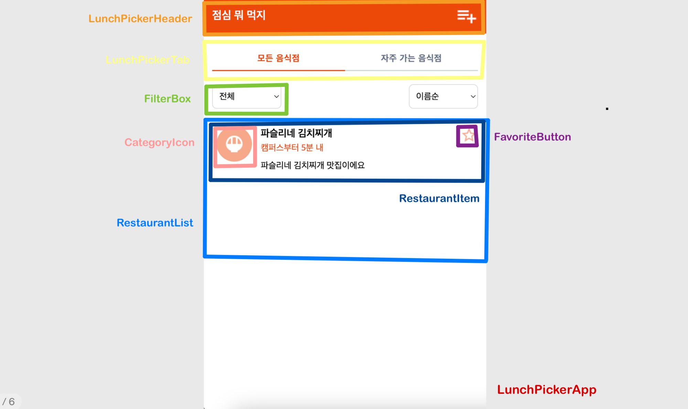
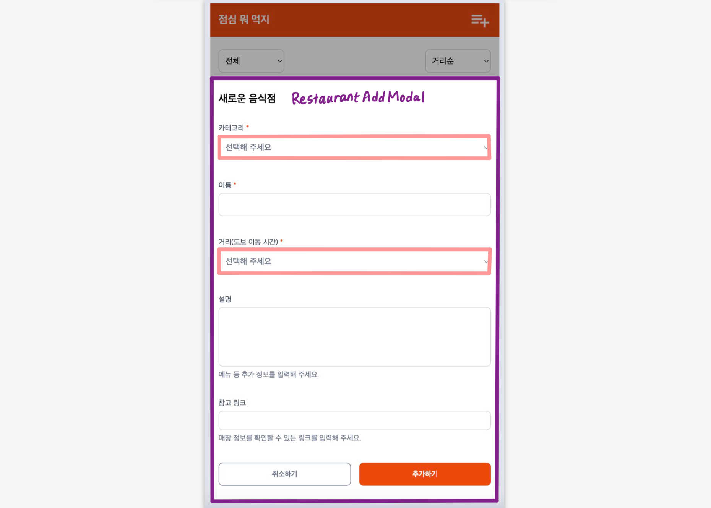

# 1단계 '점심 뭐 먹지' 기능 목록

## 도메인

### 음식점

- [x] 음식점에는 카테고리, 이름, 거리(도보 이동 시간), 설명, 참고 링크가 있다.
- [x] 카테고리, 이름, 거리는 필수이고 나머지는 선택이다.
- [x] 카테고리는 "한식", "중식", "일식", "아시안", "양식", "기타" 중 하나이다.
- [x] 거리는 캠퍼스로부터 도보로 걸리는 시간(분). 5, 10, 15, 20, 30 중 하나이다.

### 음식점 목록

- [x] 음식점 목록에 음식점을 추가할 수 있다.
- [x] 음식점을 카테고리별로 필터링할 수 있다.
- [x] 음식점을 이름순으로 정렬해서 확인할 수 있다.
- [x] 음식점을 거리순으로 정렬해서 확인할 수 있다.
- [x] 새로고침해도 추가한 음식점 정보들이 유지되어야 한다.

## UI

### Header

- [x] 음식점 추가 버튼을 누르면 새로운 음식점을 입력할 수 있다.

### RestaurantList

- [x] 음식점 목록을 출력한다.

### RestaurantItem

- [x] 음식점 정보를 출력한다.
  - [x] 카테고리는 아이콘으로 출력한다.
  - [x] 이름, 거리, 설명을 텍스트로 출력한다.

### RestaurantAddModal

- [x] 카테고리, 거리는 셀렉트 박스, 이름/설명/참고 링크는 텍스트 인풋을 사용한다.
- [x] 입력값이 잘못되었을 때는 입력창 하단에 오류 메시지 텍스트를 표시한다.

### FilterBox

- [x] 카테고리별로 필터링하기 위해 셀렉트 박스를 사용한다.
- [x] 이름순/거리순으로 정렬하기 위해 셀렉트 박스를 사용한다.

 
 

# 2단계 '점심 뭐 먹지' 기능 목록

## 도메인

### 음식점

- [x] 음식점을 삭제할 수 있다.

### 자주 가는 음식점

- [x] 자주 가는 음식점을 추가할 수 있다.
- [x] 자주 가는 음식점을 해제할 수 있다.

## UI

### 음식점 상세 정보

- [x] 카테고리, 이름, 거리, 설명, 참고 링크를 확인할 수 있다.
- [x] 음식점 상세 정보에서 자주 가는 음식점으로 추가할 수 있다.

### 자주 가는 음식점

- [x] 자주 가는 음식점 탭에서 추가한 음식점 목록을 확인할 수 있다.

 
 

# '점심 뭐 먹지' 테스트 목록

## E2E 테스트

- [x] 새로운 음식점을 추가할 수 있는지 테스트한다.
- [x] 음식점을 클릭하면 음식점 상세 정보를 확인할 수 있는지 테스트한다.
- [x] 음식점을 삭제할 수 있는지 테스트한다.

- [x] 탭을 클릭하여 음식점 목록을 확인할 수 있는지 테스트한다.

  - [x] 모든 음식점
  - [x] 자주 가는 음식점

- [x] 음식점 목록을 카테고리별로 필터링할 수 있는지 테스트한다.

  - [x] 한식
  - [x] 중식
  - [x] 일식
  - [x] 아시안
  - [x] 양식
  - [x] 기타

- [x] 음식점 목록을 이름순/거리순으로 정렬할 수 있는지 테스트한다.

  - [x] 이름순
  - [x] 거리순

- [x] 자주 가는 음식점을 추가할 수 있는지 테스트한다.
  - [x] 음식점 목록
  - [x] 음식점 상세 정보
